# 講義AITuber 機能フロー

- 文書状態: 確定
- 対象: MVPおよびOSSとしての最終形
- 更新日: 2026-09-13
- 関連文書: `../aituber_lecture_spec_v0.2.html`

この文書は、講義AITuberの機能境界と自動進行を図で定義する。要件が競合する場合は `../REQUIREMENTS.md` を優先する。

## 1. 説明の分類

講義で使う説明を、本編、事前補足、ライブ補足の3種類に分ける。

- **本編**: 授業前にCourse Packageへ生成され、授業の主線を構成する説明。
- **事前補足**: 想定質問に対して授業前に生成される説明。教材ごとの設定で自動再生を許可できる。
- **ライブ補足**: 授業中の未想定質問に対し、その場で生成する一時的な説明。教材本体を書き換えず、授業の分岐として実行する。

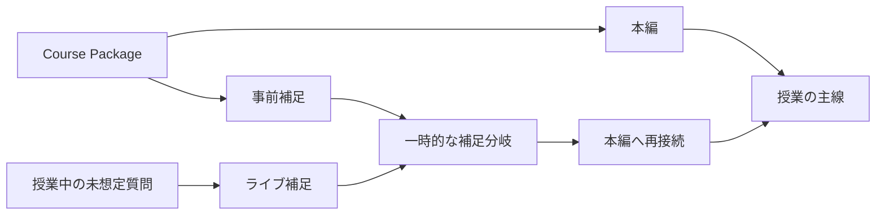

## 2. 全体フロー

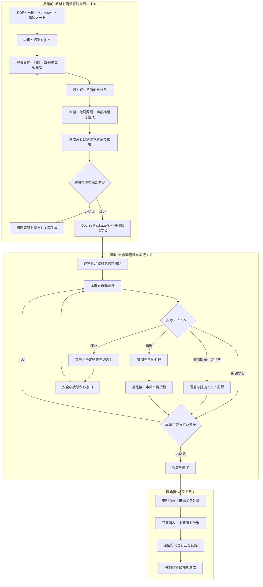

## 3. 教材作成と自動審査

教材作成は自動化を基本とする。利用者は1つのLLM用APIキーとモデルを設定すればよく、複数のLLM ProviderやAPIキーを要求しない。音声合成にはFish Audio用のキーを別に1つ登録する。同じLLMを使いつつ、生成時の会話履歴を渡さない独立した審査コンテキストと審査用プロンプトで利用可否を判定する。

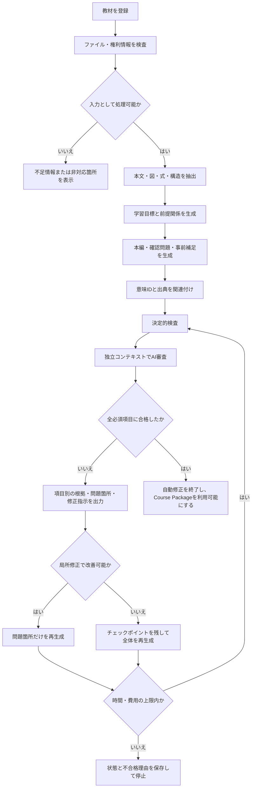

## 4. 授業状態

開始ボタンが押された後は、通常進行を自動化する。運営者の継続操作を前提にしない。停止や復旧などの例外操作は残す。

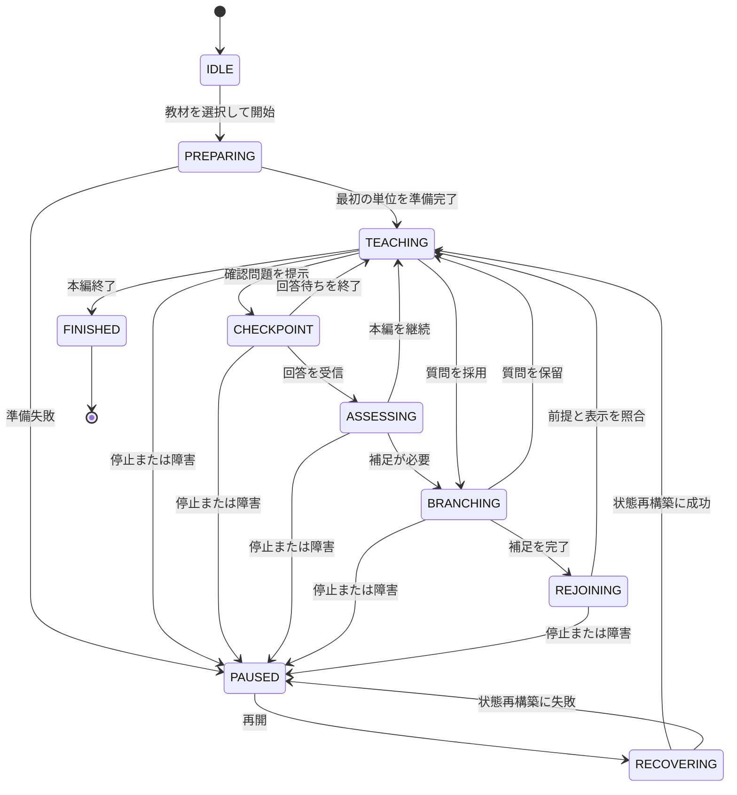

## 5. 質問とライブ補足

新規ライブ補足は、教材内の情報と許可された描画・計算規則だけを使用する。人のライブ承認は通常フローに含めない。

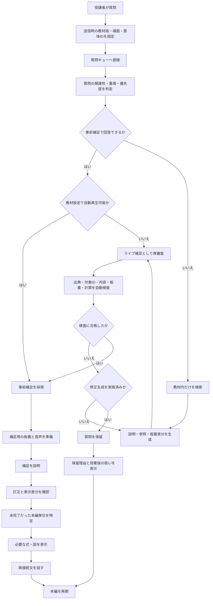

## 6. 補足準備中の進行

本編が継続できる場合は、裏で補足を準備しながら本編を進める。質問や補足が連続し、本編を進めると理解を損なう場合は、短いつなぎ文で待ち時間を埋める。

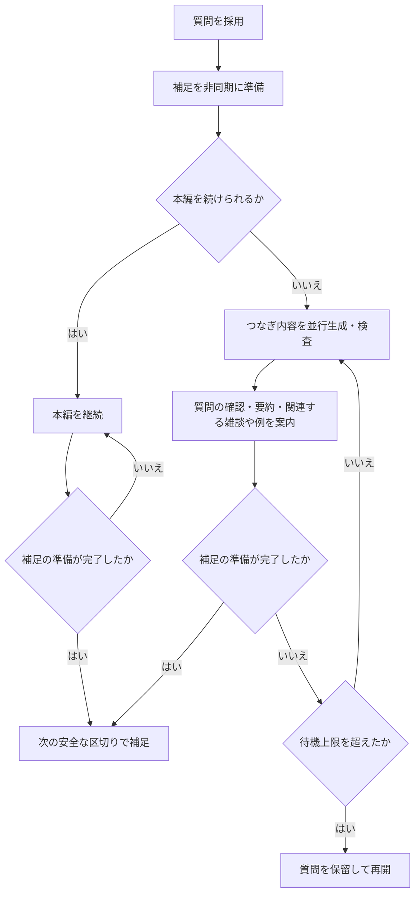

つなぎ文には、質問の復唱、対象箇所の確認、処理状態、既に提示済みの内容の要約に加え、関連する雑談や日常的なたとえを含められる。必要に応じてモデルの一般知識も使えるが、新しい事実や例を含む場合はライブ補足と同様の根拠・内容検査を通す。教材作成時に用意したつなぎ候補を優先し、足りない場合だけ補足とは別に並行生成する。この挙動は教材ごとの設定項目にしない。

## 7. 質問キュー

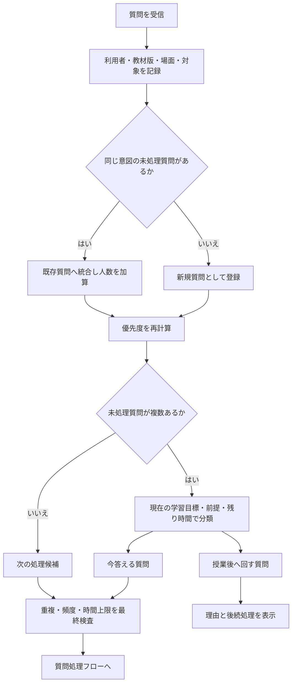

MVPの具体的な優先規則、重複判定、連投制限、同点時の扱いは[質問受付と優先キュー](./questions.md)に固定する。生成、独立審査、つなぎ、再接続の実装規則は[ライブ補足と本編への再接続](./live-supplements.md)に固定する。

## 8. 能動的な補足

AITuberは、明示的な質問がなくても、観測できた学習上の証拠から必要性を判断して補足できる。顔、視線、沈黙は入力に使わない。

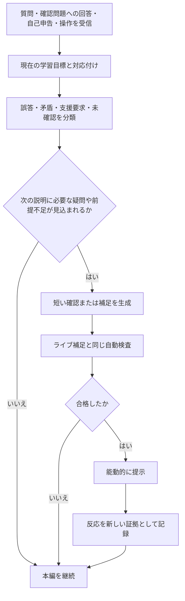

疑問の予測は、質問文、回答内容、自己申告、教材内の前提関係、同じ授業で観測された操作を使う。視聴者が発話しなかった時間から理解不足を推定しない。能動的な確認は、教材上の難所、確認問題の誤答、矛盾する回答、支援要求、次の説明に必要な前提不足がある場合に行う。

サービス共通の教授方針は、本編を進めながら重要箇所で確認問題を出し、観測済みの証拠に応じて説明を変えることとする。全編を問い返し中心にはせず、定義を求められた場合は定義を説明する。

## 9. 蓄積データの圧縮と再利用

MVPでは現在の授業の証拠だけを教授判断に使う。利用が増えた段階で、過去の生の対話や回答をそのまま長期参照せず、知識要素、誤解候補、発生頻度、補足後の結果へ変換して集約する。教科・分野ごとの全対話を常時保持する設計にはしない。

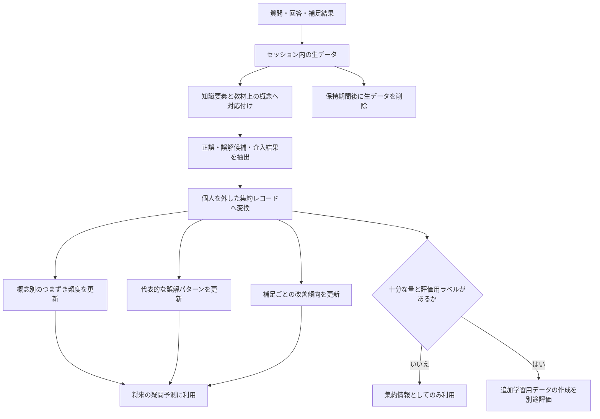

追加学習を行う場合も、モデルへ生の対話を無条件に投入しない。集約情報から作った学習例、品質ラベル、独立した評価セットを用意し、改善を確認できた場合だけ採用する。集約情報は各インストールの内部だけで利用し、OSS環境をまたいで送信・共有しない。

この方針は、対話ターンから知識要素と正誤を抽出するDialogue Knowledge Tracing、誤解仮説を既知の誤解ラベルへ検索・再順位付けするMisconception Diagnosis、計画と評価駆動メモリを分離するScaffoldLMを参考にしている。連合学習は将来の候補だが、教育分野での適用はまだ限定的である。

- [Exploring Knowledge Tracing in Tutor-Student Dialogues using LLMs](https://arxiv.org/abs/2409.16490)
- [Misconception Diagnosis From Student-Tutor Dialogue: Generate, Retrieve, Rerank](https://arxiv.org/abs/2602.02414)
- [Planning-Guided Tutoring with Assessment-Driven Memory for Pedagogical LLM Tutors](https://aclanthology.org/2026.acl-long.325/)
- [Towards Privacy-Preserving Data-Driven Education: The Potential of Federated Learning](https://arxiv.org/abs/2503.13550)

## 10. 停止と復旧

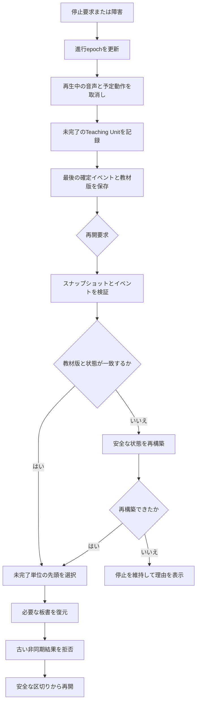

## 11. 回答と理解の証拠

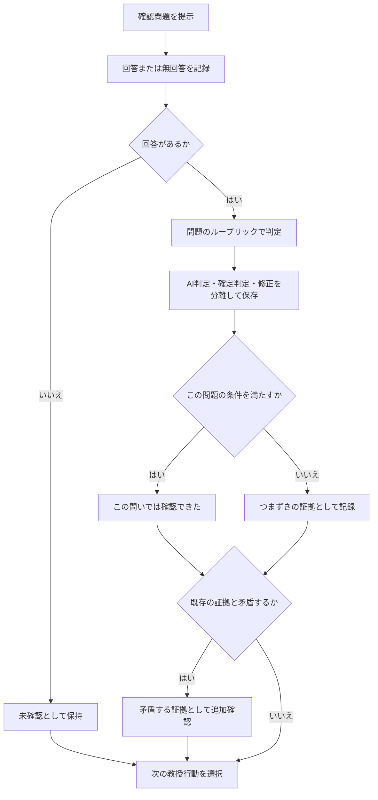

回答を単元全体の習得率へ自動変換しない。閲覧、無回答、自己申告、問題への回答を別の証拠として扱う。保存形式、5状態、ルーブリック判定、能動的な補足の実装規則は[確認問題、学習証拠、能動的な補足](./learning-evidence.md)に固定する。

## 12. 授業生成時の入力

利用者が必ず指定するのは授業時間だけとする。対象レベルと学習目標は教材から自動生成し、開始前に表示する。推定が違う場合は開始前に修正できる。説明スタイルは利用者設定にせず、サービス共通の教授方針として要件に固定する。

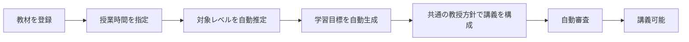

## 13. 音声合成

MVPでもシステム標準音声ではなく、講義に適した外部TTSを使用する。標準はFish Audio `s2.1-pro-free` とし、利用条件を満たす既存のプリセットまたは公開音声を1つ選ぶ。83言語、ストリーミング、音声とテキスト区間のタイムスタンプを利用できるため、字幕、ポインタ、口の動きの同期に使う。実装時に日本語の数式読み、固有名詞、遅延、長文の連続性を実測し、受入条件を満たさない場合だけ比較候補へ切り替える。

比較候補はElevenLabs、OpenAI `gpt-4o-mini-tts`、Google Cloud Text-to-Speechとする。利用者向けに多数のProvider設定を最初から露出せず、内部のTTS契約だけを交換可能にする。

- [Fish Audio Models Overview](https://docs.fish.audio/developer-guide/models-pricing/models-overview)
- [Fish Audio Stream with Timestamps](https://docs.fish.audio/api-reference/endpoint/openapi-v1/text-to-speech-stream-with-timestamps)
- [ElevenLabs Text to Speech](https://elevenlabs.io/docs/overview/capabilities/text-to-speech)
- [OpenAI GPT-4o Mini TTS](https://developers.openai.com/api/docs/models/gpt-4o-mini-tts)
- [Google Cloud Text-to-Speech SSML](https://docs.cloud.google.com/text-to-speech/docs/ssml?hl=ja)

## 14. 授業後の質問処理

授業中に扱わなかった質問は放置しない。授業末に時間があれば学習目標に近い質問へ回答し、残りは授業後に自動生成・自動審査して閲覧可能にする。時間判定、公開ゲート、未回答理由、結果表示、任意アンケートの実装規則は[授業末と授業後の処理](./after-class.md)に固定する。

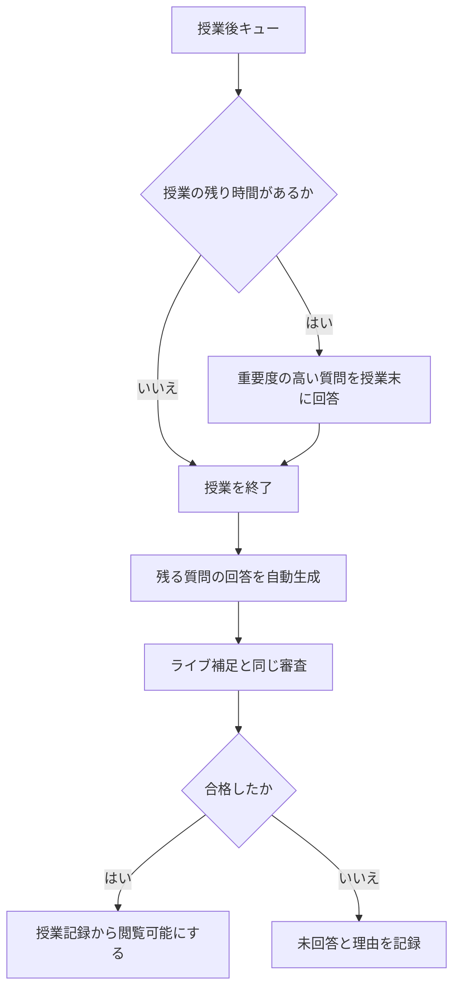

## 15. 役割と権限

同じ人が複数の役割を兼任できる。開始後の通常進行はシステムが担い、運営者の継続操作を要求しない。

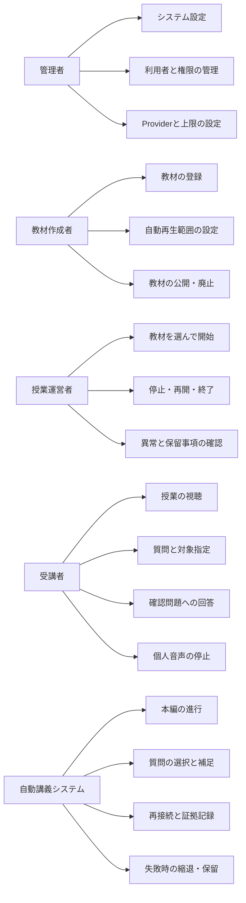

## 16. MVPと製品公開の完成条件

MVPの完成は、Maniが受講者・運営者を兼ね、3本の講義を質問、補足、再接続を含めて完走できた時点とする。製品としての公開は、成人6〜10人によるユーザビリティ評価を完了し、見つかった致命的な問題を修正した後とする。

MVPの教材fixtureは、次の3本とする。

1. 高校数学「二次関数」
2. 高校生物「DNA複製」
3. 大学レベル「VAEの再パラメータ化」

## 17. MVPの参加方法

受講者は同じLAN上の教室URLと短い教室コードで参加する。MVPではアカウント登録を要求せず、セッション限定の匿名IDを発行する。表示名は任意とする。認証強化は利用範囲を外部へ広げる段階で追加できる境界を残す。

## 18. 生データと改善

MVPでは質問、回答、イベント、板書の生データを既定7日間ローカルに保持する。用途は、授業の再生、障害の再現、保留質問への回答、補足前後の変化の確認とする。任意の授業後アンケートは「質問した箇所を理解しやすくなったか」「補足後、本編へ自然に戻れたか」の2件の固定評価と自由記述で構成し、回答証拠とは分けて保存する。

7日後は個人に結び付く生データを削除する。将来の改善に残す場合は、概念、誤解候補、発生頻度、補足後の結果、アンケート評価へ集約する。生データと集約情報は各インストールの内部だけで扱い、外部サーバーや別のOSS環境へ送信・共有しない。

## 19. 現在の自動化境界

| 機能 | MVPの既定動作 |
|---|---|
| 教材抽出・講義生成 | 自動 |
| 教材の内容審査 | 同一モデルを独立したコンテキストとプロンプトで使用して自動審査 |
| 教材の自動修正 | 全必須項目の合格で即終了。未合格なら時間・費用上限内で継続 |
| Course Package利用 | 自動審査合格後、その環境内で講義に利用可能 |
| Course Package共有 | MVPでは提供しない。利用規模が拡大した段階で公開カタログを検討 |
| 本編進行 | 開始後は自動 |
| 事前補足 | 教材で許可済みなら自動再生 |
| ライブ補足 | 自動生成・自動検査・自動再生 |
| ライブ補足の修正 | 不合格時の再生成は1回 |
| 補足準備中 | 本編継続、または限定したつなぎ文 |
| 質問の保留 | 自動。理由と後続処理を表示 |
| 能動的な補足 | 質問・回答・自己申告・操作から判断。顔・視線・沈黙は使わない |
| 過去傾向の利用 | MVP対象外。将来は生データを概念・誤解・介入結果へ圧縮して利用 |
| 教材外の一般知識 | 授業中に強調表示せず、授業記録で区別できるようにする |
| 授業後の質問 | 残り時間内で一部回答し、残りは授業後に自動生成・審査 |
| 停止・再開 | システムによる自動処理と、運営者による例外操作 |
| 理解状態 | 証拠を自動記録。未観測の理解は推定しない |
