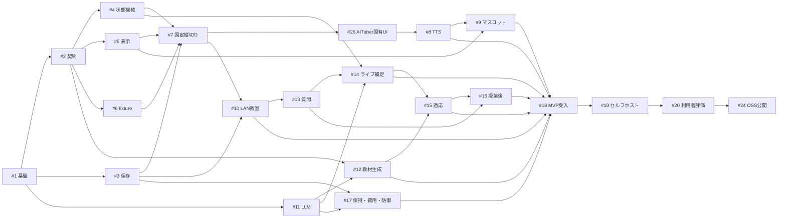

# 講義AITuber 実装計画

- 状態: 確定
- 更新日: 2026-09-14
- 正本: [REQUIREMENTS.md](../REQUIREMENTS.md)

## 方針

実装は、固定入力で再現できる講義実行核を先に完成させ、その後に外部AI、質問、適応処理を接続する。各段階の終了時にブラウザー上で動く経路を残す。Issue番号はGitHub登録後の番号と一致する。

## 実装順

### M0 基盤

1. **#1 開発基盤とアーキテクチャ境界** — TypeScript、React、Node.jsのワークスペースと品質ゲートを作る。
2. **#2 Course Package契約** — 教材、Teaching Unit、表示、確認問題、補足のランタイム検証可能な契約を定める。
3. **#3 永続化とイベント再生** — SQLite、スナップショット、epoch、冪等性を実装する。
4. **#4 講義状態機械** — AIやUIに依存しない決定的な進行核を実装する。
5. **#5 表示・板書・意味ID** — 安全な描画器、意味ID、ポインタを実装する。

### M1 決定的な縦切り

6. **#6 3教材fixture** — 二次関数、DNA複製、VAE再パラメータ化の固定Course Packageを用意する。
7. **#7 固定講義の縦切り** — 運営画面から固定音声の講義を開始・停止・再開・終了できるようにする。
8. **#26 AITuber固有UI** — Liberka向けの設計を撤回し、独自の学習スタジオと制御卓へ置き換える。
9. **#8 Fish Audioと同期** — TTS、字幕、タイムスタンプ、キャッシュ、取消しを接続する。
10. **#9 軽量2Dマスコット** — 通常、口開き、注目、反応を授業タイムラインへ同期する。
11. **#10 LAN教室と再接続** — 教室コード、1〜5人、WebSocket追従、端末再接続を実装する。

### M2 自動教材と適応講義

12. **#11 OpenAI互換LLM接続** — 単一のキー、モデル、任意Base URLと構造化応答を実装する。
13. **#12 教材生成・審査・修復** — 取り込みから利用可能なCourse Packageまでを自動化する。
14. **#13 質問受付と優先キュー** — 意味ID付き質問、統合、今回答・授業後の分類を実装する。
15. **#14 ライブ補足と本編再接続** — 自動生成、検査、1回再試行、つなぎ、本編復帰を実装する。
16. **#15 確認問題と能動的補足** — 証拠モデル、判定、疑問予測、教授分岐を実装する。

### M3 MVP完成

17. **#16 授業後処理とアンケート** — 保留回答、結果画面、固定2問と自由記述を実装する。
18. **#17 保持・費用・入力防御** — 7日削除、費用予約、秘密情報と非信頼入力の境界を実装する。
19. **#18 MVP総合受入** — 故障注入、性能測定、3講義の一人完走でFR/NFRを確認する。

### M4 製品化と将来段階

20. **#19 セルフホスト配布**
21. **#20 成人6〜10人のユーザビリティ評価**
22. **#21 許可済み外部資料の利用**
23. **#22 音声質問**
24. **#23 インストール内の圧縮済み傾向利用**
25. **#24 OSS公開準備とCourse Packageカタログ**
26. **#25 OBS・配信コメント接続**

リポジトリは #24 が完了し、公開判断を行うまでprivateを維持する。

## 依存関係

## 完了の扱い

- 各Issueは、記載した受入条件を自動試験または実ブラウザーで確認して閉じる。
- Providerへ接続できることと、教育上正しく動くことは別に記録する。
- MVPは #18 の完了で成立する。#19以降はMVP完成後に着手する。
- NFRの目標未達は測定値と理由を残す。停止・整合性・秘密情報保護の未達はMVP完成扱いにしない。
