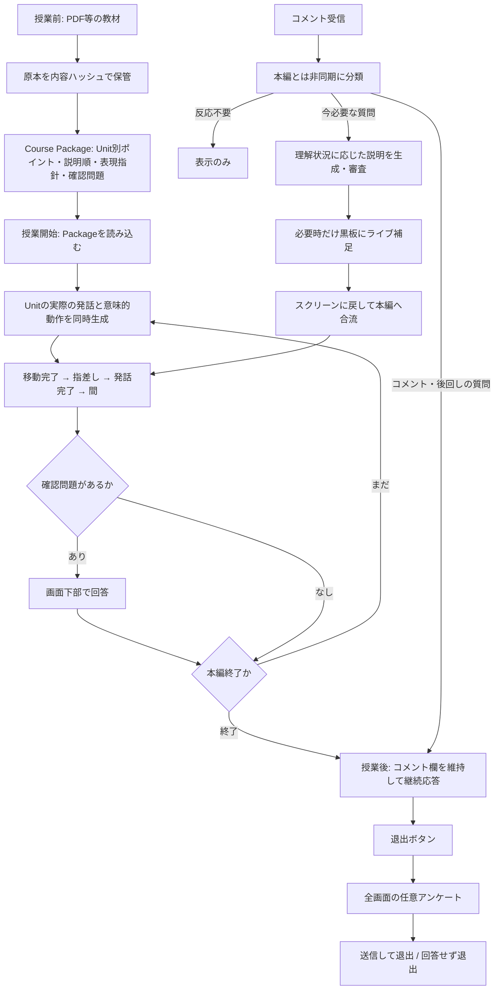

# 授業中の台本と演出

## 範囲と将来の境界

常時配信のホストが教材を検索・選択し、授業を起動して、終了後に通常配信へ戻る構成を前提とする。今回は授業の起動から終了までを独立した実行単位とし、教材検索・雑談・常時配信のループは実装しない。Course Packageは教材と教育上の制約を保持し、既存speechTextは参考台本と障害時の代替として扱う。

## 実装順

1. 発話と演出の型、許可操作、実行状態を定義する。
2. 教材・直前の発話・理解状況・残り時間から短い実行列を生成する。対象IDと操作を検証し、生成失敗・未設定時は参考台本へ戻す。LLMは自由なコードや関節角度を生成しない。
3. 実行器が移動→到着→指差し→発話→終了→間を管理する。pause/finishで非同期生成・動作・音声を無効化する。発話中に次Unitを先読みし、補足・回答等で文脈が変われば破棄する。
4. VRMは意味的な操作を受け取り、補間・歩行・姿勢を実行する。カメラは固定した説明用・教材用・黒板用の視点を安全な区切りで切り替える。
5. 授業の可読性を保つ教室セットを整え、外部モデルの出典・ライセンスを記録する。
6. 生成失敗、対象不正、順序、到着待ち、音声完了、キャンセル、先読み失効をテストする。実LLMとブラウザーでも確認する。

## 実行規則

- 操作は move_to / point_at / speak / release_point / pause / camera に限定する。
- speakは同時に1つ。move_toの完了前にspeakを開始しない。point_atは発話中に保持できる。
- 字幕は実際に生成された発話と一致させる。
- 位置指定は教材を隠さない範囲に補正する。カメラは発話中に頻繁に切り替えない。
- 同じepoch内の同じ操作IDへの完了通知のみ受理する。接続者なしでも規定時間で授業が進む。
- 教育上の表現指定と説明必須事項は生成入力へ渡す。モデルの出力を教材の訂正として自動反映しない。

## 3Dセット候補

- [classroom / Jonathan Granskog](https://poly.pizza/m/2BTjD6QAdt): GLTF/OBJ、CC Attribution。配布条件と実際の画角を確認して採否を決める。
- [classroom / li chang](https://poly.pizza/m/asttONe8Bxi): 同じくCC Attribution。
- 外部セットは背景用途とし、教材スクリーン・黒板・先生の操作対象はアプリ側で維持する。

## 実装結果

- `lesson-director.ts`: LLMは1〜3個の発話区切りを生成し、各区切りに発話文・対象ID・立ち位置・固定カメラを指定する。実行器へ渡す際に許可操作列へ変換する。これによりLLMが発話を含まない無意味な操作列を出すことを防ぐ。
- `FixedLectureService`: 授業内の生成・操作・発話を順番に実行し、動作完了通知、音声末尾の待機、epochによる取消し、文脈付き先読みを管理する。終了状態をホストが検知する境界は既存のFINISHEDとする。
- Course Packageの`speechText`は削除せず、参考台本と障害時の代替にする。`speakingGuidance`で必須・禁止表現と説明上の注意を渡せる。生成した操作列をイベントに保存する。
- 短い発話区切りごとの字幕・TTSは生成文を使う。ライブ補足は既存の授業中生成経路を維持する。
- 現在のセットでは教材を隠さない右側の立ち位置に補正する。固定視点は授業・教材拡大・黒板用。主教材の演出生成では授業・教材拡大を選び、黒板は補足の表示に合わせる。
- Jonathan Granskogのclassroom GLBを同梱。前面の壁と教材に重なる机を撮影時だけ非表示にし、窓・カーテン・照明・周辺家具を背景として使う。クレジットは画面の「素材」と同梱LICENSE.mdに記載。
- 実接続のOllama `qwen3:8b`で生成を確認。短い台本でも約14秒の例があり、初回の準備待ちと先読みで吸収する。生成待ちが上限を超えた場合は参考台本で継続する。

まだ含まないもの: 常時配信・雑談、コメントからの教材検索と自動選択、授業終了後の配信ホストへの自動復帰、モーションキャプチャや完全な足接地IK。

## 2026-09-15: 授業ライフサイクルの正本

- 原本はauthoringディレクトリの`sources/<SHA-256>`に保持し、Course Packageのsource.contentHashから対応する。PDF抽出テキストだけを保存して原本を失うことはしない。
- `teachingPlan.keyPoints / explanationFlow`を新規作成時に生成する。旧Packageは参考説明を使って互換維持する。確認問題は既存assessmentのafterUnitIdで関連付ける。
- 投稿はpending状態で即受理。LLMがimmediate / later / comment / ignoreを判定し、immediateのみ授業内優先度判定へ渡す。障害時は授業を割り込ませず後回し。判定結果はSQLiteに保存する。
- 授業後は投稿イベントにも応答処理を起動する。処理中に届いた投稿も次の処理で拾い、反応不要の投稿には回答を生成しない。終了直前に保留質問を本編へ昇格させない。
- コメントと回答は右側の同じ欄に残す。退出時にネイティブdialogを全画面表示し、戻る・未回答退出を可能にする。
- カメラは正面・右斜め前・左斜め前の3つ。注視点より約0.8m高い位置からわずかに見下ろす。1秒ごとに先生の頭・胴・手を含む投影境界と教材面の重なり、教材の画面外へのはみ出しを比較する。カット後10秒は次のカットを禁止し、同点付近では現視点を優先する。教材専用カメラで先生を消す処理は廃止。
- 教室は既存メッシュに木床のPBR素材、壁の微細な凹凸、金属の反射、抑えた布色、柔らかい影と窓側の補助光を追加する。写実的な建築モデルへの全面置換ではなく、既存セットの質感改善。木床はPoly Haven Wood Floor (CC0)。
- 常時配信から教材検索・授業開始・通常配信へ復帰するホストは次段階。この実装の境界は授業開始とFINISHED。

### 検証と接続修正

- 全体チェック: lint・型・テスト・ビルド・クライアント境界・3教材セルフホスト検証を通過。
- ブラウザー: 終了後のコメント入力継続、反応不要の「わかった！ありがとう」に返答しないこと、全画面アンケートと教室へ戻る操作を確認。
- 実Ollamaで審査の構造化出力がHTTP 400になる問題を確認。長いmaxLengthと配列を組み合わせた文法展開がllama.cppの上限を超えていた。Ollamaへ送る文法からmaxLengthのみ除き、元スキーマでの受信後検証と出力トークン・バイト上限は維持する。
- 接続修正後、実Ollamaで終了後に新規投稿した頂点形式の質問に対して、生成・審査を経た回答が同じコメント欄へ表示されることを確認。
- 800×1000の縦長PC画面で講義が上・コメントが下、文書全体のスクロールなし。1280×720で退出dialogが画面全体と一致することを確認。
