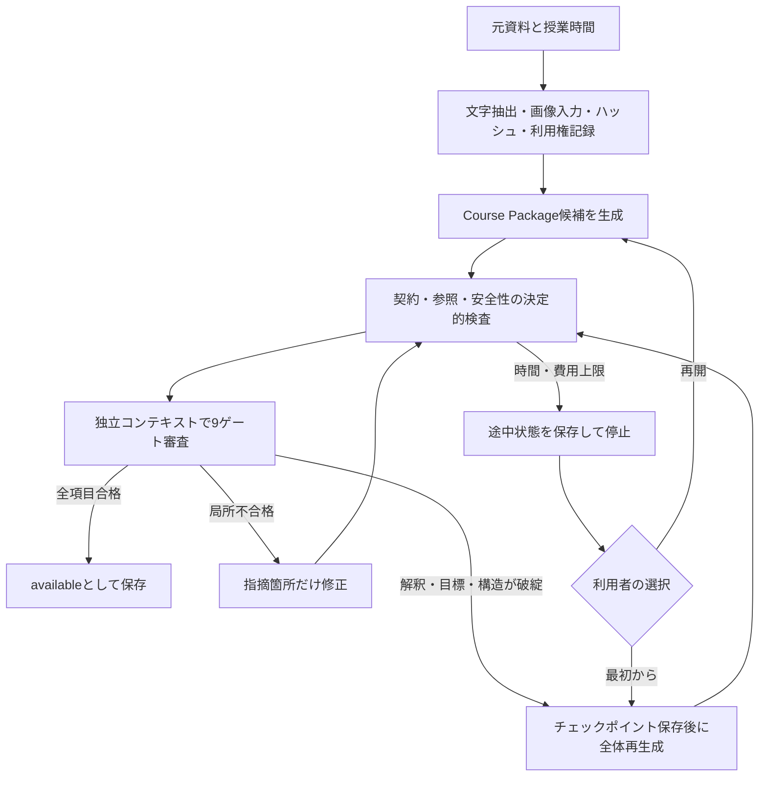

# 教材の取り込み・生成・審査

教材作成は授業の開始前に行う。運営画面でPDF、PNG、JPEG、WebP、Markdown、テキストまたは任意ノートを登録し、授業時間を指定すると、単一の設定済みLLMがCourse Packageを生成する。対象レベルと学習目標は通常は自動推定し、明らかに違う場合だけ詳細欄から指定して再実行できる。

## 自動処理

生成と審査は同じモデルを利用できるが、会話履歴を共有しない。審査は出典対応、事実・式・数値、学習目標、前提、参照、描画、発話と字幕、安全な内容、利用権の9項目について、合否、根拠、問題箇所、修正指示を保存する。全項目が合格した時点で直ちに終了する。

修復回数は固定しない。既定では累積5分または推定2 USDのどちらかに達するまで続ける。モデルから費用情報が返らない接続では費用を0として扱い、時間上限で停止する。上限到達時は候補、審査結果、試行回数、経過時間、推定費用をローカルのチェックポイントへ保存する。運営画面から追加の5分・2 USDを与えて再開するか、入力を残したまま最初から作り直せる。

## 入力と保存

- 1ジョブにつき1〜16資料とする。PDFとテキストは各20 MiB、画像は各10 MiBまで受け付ける。
- PDFとテキストは各350,000 byte、全資料合計400,000 byteまで抽出する。画像はモデルの画像入力へ渡す。
- 元資料ごとにSHA-256、ファイル名、形式、利用権根拠をCourse Packageへ記録する。
- 教材内の命令文は信頼せず、生成・審査用の指示より優先しない。
- チェックポイントは既定で `.data/authoring` に0600権限で保存する。
- `available` になったCourse Packageだけを講義サービスへ登録する。不合格や処理途中の候補は講義選択肢に現れない。

開発・受入試験で保存先を分離するときは `AITUBER_AUTHORING_PATH` と `AITUBER_LLM_SETTINGS_PATH` を指定できる。
