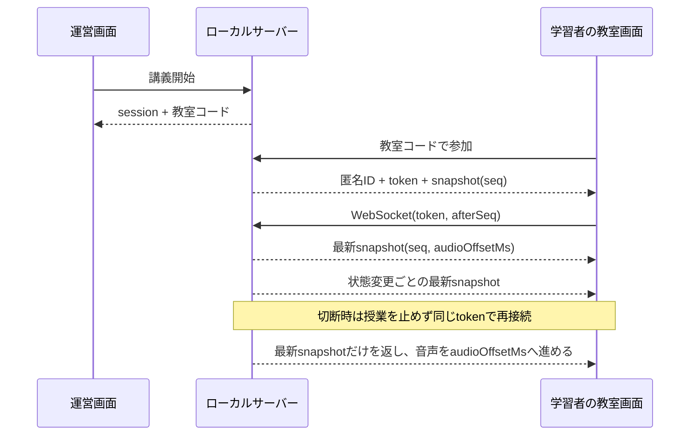

# LAN教室の参加と同期

運営者が講義を開始すると、6文字の教室コードが発行される。学習者は同じLAN上の教室URLを開き、コードだけで参加する。アカウントや表示名は要求しない。1授業の定員は5人で、参加時にその授業だけで有効な匿名IDと推測困難な参加トークンを発行する。



## 起動

既定値は `127.0.0.1` で、このMac以外からは接続できない。同じLANへ教室を公開するときだけ、MacのプライベートIPを `.env` の `AITUBER_LAN_HOST` に設定して `pnpm dev` を起動する。

```dotenv
AITUBER_LAN_HOST=192.168.1.20
```

起動ログに運営画面と教室画面のURLが表示される。`0.0.0.0`、公開IP、ホスト名は拒否する。APIサーバーと運営画面はloopbackに固定し、教室画面だけを指定したLANアドレスへbindする。教室経路からは教材一覧、教材管理、講義の一時停止・終了、他の参加者情報へアクセスできない。回答は自分の参加トークンを付けた専用APIだけで送る。

## 再接続境界

授業状態の更新には授業内で単調増加する `seq` を付ける。再接続した端末には差分音声を連続再生せず、現在の完全なsnapshotを送る。再生中ならサーバー時刻基準の `audioOffsetMs` まで音声要素を進めるため、切断中に終わった箇所を読み直さない。端末の切断は参加者のWebSocketだけを閉じ、講義タイマーや他の端末には影響しない。
