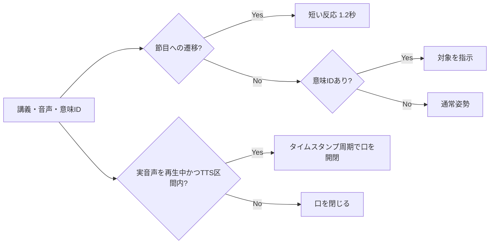

# 軽量2Dマスコット

## 役割

マスコットは講義の主役ではなく、音声が再生されていることと、現在説明している意味IDを視覚的に補助する。教材、数式、字幕の可読領域を優先し、教室ステージ右上の小さな固定領域だけを使う。

## 状態契約

| 状態 | 入力 | 表示 |
| --- | --- | --- |
| 通常 | 音声停止、対象なし | 正面、口を閉じる |
| 口開き | ブラウザーで音声を再生中、TTS区間内 | 280ms周期のうち160msだけ口を開く |
| 注目・指示 | 現在の音声区間または選択操作に意味IDがある | 対象方向へ腕を伸ばし、対象名を支援技術へ通知する |
| 短い反応 | 確認問題または終了へ状態遷移 | 1.2秒だけ反応し、口を閉じる |

注目・指示と口の開閉は同時に成立できる。短い反応は最優先し、反応中は口を閉じる。

## 音声との境界

- サーバーの `playing` だけでは口を動かさず、ブラウザーの音声要素が実際に `playing` になったことも確認する。
- ブラウザーの一時停止、講義停止、TTS失敗による字幕継続、区間外では口を閉じる。
- 音声の強さをまだ取得していないMVPでは、TTS区間内の経過時間から決定的に開閉する。
- reduced motionでは反応のアニメーションを止めるが、状態を示す形状は保つ。

## レスポンシブ配置

1080pでは見出し右側の108px以内、375pxでは縮小した約52px以内に収める。ステージ本文の上へ重ねず、見出し側に同じ幅の余白を確保する。ページ全体のサイズやスクロール責任は変更しない。
