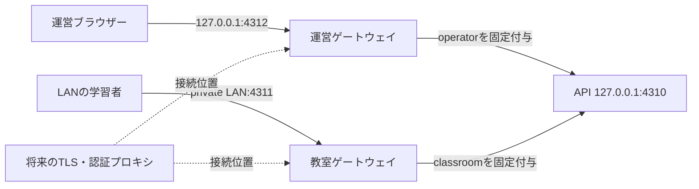

# セルフホスト運用

AITuberは1台のコンピューターでAPI、運営画面、教室画面を動かします。APIと運営画面は常にループバックへ閉じ、教室画面だけを設定したプライベートLANアドレスで公開します。

## 対応環境

- Node.js 22系とpnpm 10系
- macOS arm64。macOS 27.0、Apple Silicon、Node.js 22.14.0、pnpm 10.7.0で受入済み
- Linux x64/arm64は配布対象。Node.js 22と`better-sqlite3`を導入でき、SQLiteのファイルロックを提供するローカルディスクが必要
- メモリ16GBを基準とする。MVP総合受入では追加使用量6GB以内を確認済み

DBをNFS、SMB、Dropboxなどの同期・共有ディレクトリへ置かないでください。ブラウザーは現行のChrome、Edge、Safariを対象とします。2026-09-14時点の自動受入はChromiumで実施しています。

## 導入

現在リポジトリはprivateです。アクセス権のある環境で取得します。OSS公開後も同じ手順を使えます。

```sh
git clone https://github.com/mani1261790/AITuber.git
cd AITuber
corepack enable
pnpm install --frozen-lockfile
cp .env.example .env
pnpm build
pnpm check
pnpm start
```

起動後は運営画面 `http://127.0.0.1:4312` を開きます。既定の教室画面は `http://127.0.0.1:4311` です。

同じLANの端末を参加させる場合は、`.env` の `AITUBER_LAN_HOST` をホストのプライベートIPへ変更します。`10.0.0.0/8`、`172.16.0.0/12`、`192.168.0.0/16`、リンクローカル、プライベートIPv6だけを受け付け、ワイルドカードや公開IPは拒否します。ファイアウォールでは教室ポート4311だけを信頼するLANから許可してください。

LLMとFish Audioは、それぞれ[LLM接続](./llm.md)と[音声設定](./audio.md)に従って設定します。APIキーを設定しない状態でも固定3教材と字幕フォールバックで動作を確認できます。

## アプリとデータを分離する

長期運用では、Git checkoutの外に設定とデータを置きます。次の3領域を分けると、アプリを入れ替えても授業データと秘密情報が残ります。

| 領域 | 例 | 内容 |
|---|---|---|
| アプリ | `/opt/aituber/app` | Git checkout、依存、ビルド成果物 |
| 秘密設定 | `/etc/aituber/aituber.env` | LLM・TTS APIキー、モデル、データ位置 |
| 永続データ | `/var/lib/aituber` | SQLite DB、LLM画面設定、作成教材、TTSキャッシュ、バックアップ |

個人PCでは`$HOME/.config/aituber/aituber.env`と`$HOME/.local/share/aituber`でも構いません。envファイルのパス値には、`$HOME`ではなく実際の絶対パスを書きます。

```dotenv
AITUBER_DATA_DIR=/absolute/path/to/aituber-data
AITUBER_LAN_HOST=127.0.0.1
AITUBER_PORT=4310
AITUBER_CLASSROOM_PORT=4311
AITUBER_OPERATOR_PORT=4312
AITUBER_LLM_API_KEY=
AITUBER_LLM_MODEL=
AITUBER_FISH_AUDIO_API_KEY=
AITUBER_FISH_AUDIO_MODEL=s2.1-pro-free
AITUBER_FISH_AUDIO_VOICE_ID=b2d9d8db057042688a5e318b8f405bc2
```

```sh
set -a
. /absolute/path/to/aituber.env
set +a
pnpm start
```

`AITUBER_DATA_DIR`から`aituber.db`、`llm-settings.json`、`authoring/`、`tts-cache/`、`backups/`を導出します。個別の`AITUBER_*_PATH`で上書きもできます。`.env`と`.data/`はGit管理外です。

## 更新

更新前にオンラインバックアップを作ります。`pnpm backup`は講義サーバーの稼働中にもSQLiteの整合したスナップショットを作成できます。

```sh
set -a
. /absolute/path/to/aituber.env
set +a
pnpm backup
git fetch origin
git pull --ff-only
pnpm install --frozen-lockfile
pnpm build
pnpm check
pnpm start
```

プロセスマネージャーを使う場合は、バックアップ後にサービスを停止し、更新・検証後に再起動します。`pnpm start`は開発サーバーを使わず、ビルド済み画面を配信します。運営画面の教室リンクは起動時のLANホストと教室ポートを読むため、更新時の再ビルドへホスト設定を埋め込む必要はありません。

## バックアップと復旧

既定では`AITUBER_DATA_DIR/backups/<時刻>`へ保存します。保存先を明示することもできます。

```sh
pnpm backup
pnpm backup -- /mnt/backup/aituber-2026-09-14
```

バックアップにはSQLite DB、作成教材、SHA-256とサイズを記録した`manifest.json`が入ります。envファイル、LLM画面設定に保存されたAPIキー、再生成できるTTSキャッシュは含めません。秘密設定はOSの秘密管理またはアクセス制限した別媒体へ保管してください。生データ保持期限に合わせ、期限を過ぎたバックアップも削除します。

復旧時はAITuberを停止します。復旧処理はmanifestのパス、サイズ、SHA-256を検査し、既存DB、WAL、SHM、作成教材を`.before-restore-<時刻>`へ退避してから置き換えます。

```sh
pnpm restore -- /mnt/backup/aituber-2026-09-14
pnpm start
```

復旧後に講義一覧、現在の講義、作成教材を確認します。退避ファイルは確認完了後に削除できます。

## ネットワークと将来の認証境界



ブラウザーから来た`x-aituber-surface`は両ゲートウェイが破棄し、自分のsurfaceを固定してAPIへ渡します。そのため教室側から運営権限を名乗れません。APIへLANから直接接続する経路もありません。

インターネット公開時は、運営・教室ゲートウェイの前にTLS終端と認証プロキシを置き、認証済み主体をゲートウェイへ渡す層を追加します。現在の匿名参加コードはLAN内利用の境界です。TLS、レート制限、管理者認証、参加者認証を追加するまでは公開IP、ポート転送、公開トンネルへ接続しません。

## 自動受入

```sh
pnpm build
pnpm verify:self-host
```

この受入は一時データ領域と一時ポートでプロダクション構成を起動し、固定3教材を運営ゲートウェイから開始して教室ゲートウェイから参加・WebSocket受信・再接続・回答・完走します。同時にsurface偽装拒否、起動時教室URL、稼働中バックアップ、別ディレクトリへの復旧とハッシュ一致を検証します。`pnpm check`にも含まれます。
